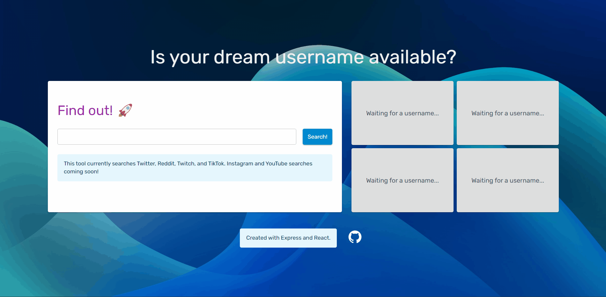

# Username Availability Checker

Want to pick up a new username? Here's [a tool to effortlessly check what's available](https://username-availability-checker.onrender.com/)! Hosted on Github Render. For list of planned additions, check out the Up and Coming Features section!

## ✅ Demo

## 🔥 Up and Coming Features

- Search notifications: If a username you want isn't available, set a frequency for how often the app should check for its availability. When it's available, we'll let you know.
- Instagram, YouTube and Facebook username searches

## 📦 Behind the Scenes: Technologies Used

This project uses an Express server to support client requests. For Twitter, Twitch, and Reddit searches, the app uses Axios to make requests to the APIs provided by the respective social media companies. Since Tiktok does not have an easily accessible API, this app crawls Tiktok's website using the automation service Puppeteer to conduct searches.

The frontend uses React (styled with the Material UI framework).

## 💻 Reproduce the Project Locally

To reproduce this project locally, clone this project. Run `npm start`, and the app should be up and running!

## License

    Copyright 2023 Maryam Khan

    Licensed under the Apache License, Version 2.0 (the "License");
    you may not use this file except in compliance with the License.
    You may obtain a copy of the License at

        http://www.apache.org/licenses/LICENSE-2.0

    Unless required by applicable law or agreed to in writing, software
    distributed under the License is distributed on an "AS IS" BASIS,
    WITHOUT WARRANTIES OR CONDITIONS OF ANY KIND, either express or implied.
    See the License for the specific language governing permissions and
    limitations under the License.
